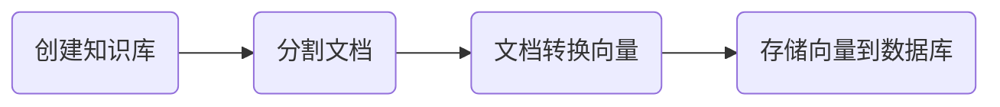
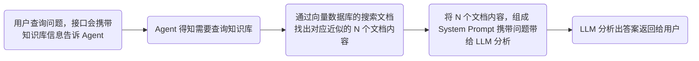

## 项目背景
之前有做一个[组件库项目](https://github.com/Asaki-M/qh-ui)，然后写了一点文档，就想着做一个知识库方便查找对应组件的文档和 API（虽然组件库项目摆烂了， 文档是写完了但还没接 RAG 的 Server， 而且项目依赖太大了白嫖不了 Vercel 的部署 ToT），顺便和之前做的一个 [Agent 项目](https://github.com/Asaki-M/novel-server)进行联动

顺带研究学习一下 RAG 相关知识

## 主要技术
- [langchain](https://js.langchain.com/docs/introduction/) 主要用他封装的分割文本的 API，而且文档说是可以根据情感语义来分割，实际用下来根本没有，只是根据`chunkSize`和`chunkOverlap`来分割，还有特定符号分割
> langchain 文档有个很离谱的问题，文档不准确会骗人的，我在用 langchain/chroma 时候就遇到了
- [chroma](https://docs.trychroma.com/docs/overview/introduction) 向量数据库，没什么好说的
- [langsearch](https://docs.langsearch.com/) 对数据库返回的 K 个向量进行重排，这个是使用 Rerank 模型来进行重排的

## 工作流程
- 文本分割 - **Chunking**
  - Langchain 有提供 API（但是用下来效果体验一般...
  - 使用 LLM 通过系统提示词分割（如果内容太多，超出上下文限制会出现幻觉，导致胡编乱造
  - 按照情感语义分割（这块没去研究
- 文本转成向量 - **Embedding**
  - 使用对应 Embedding 模型将文本转成向量，这里我用的 [Gemini](https://ai.google.dev/gemini-api/docs/embeddings)，目前是能白嫖的
- 向量存储到向量数据库 - **Search**
  - 存到对应数据库，然后根据向量数据库的向量近似度来查找最接近的向量，一般会找出 10 个，但是这里会存在一个问题，找出来第一个不代表是最接近的，因为是快速查找会存在一定误差
- 重排查出的多个向量接近度 - **Rerank**
  - 使用 Rerank 模型来进行重排，这里我使用了 [LangSearch](https://docs.langsearch.com/)，目前也是能白嫖的
  - 根据一些算法封装的库来进行重排（但是这里我是用 Express 写的，没找到有对应的库，但是我看python 是用相关的库的

### 知识库创建流程

> 注意：存入向量数据库中的内容一般是一个向量，一个原文档分割后的内容

### 用户发起查询的流程
这里是以我 Agent 的接入 RAG 来编写的

## 后续
后面会研究一下多模态的内容做 RAG，等研究完了再更新 blog
